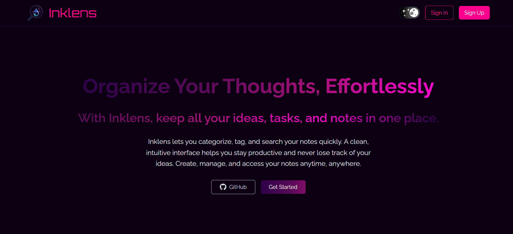
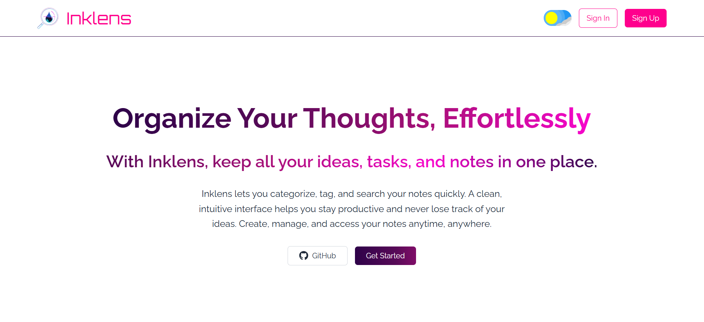
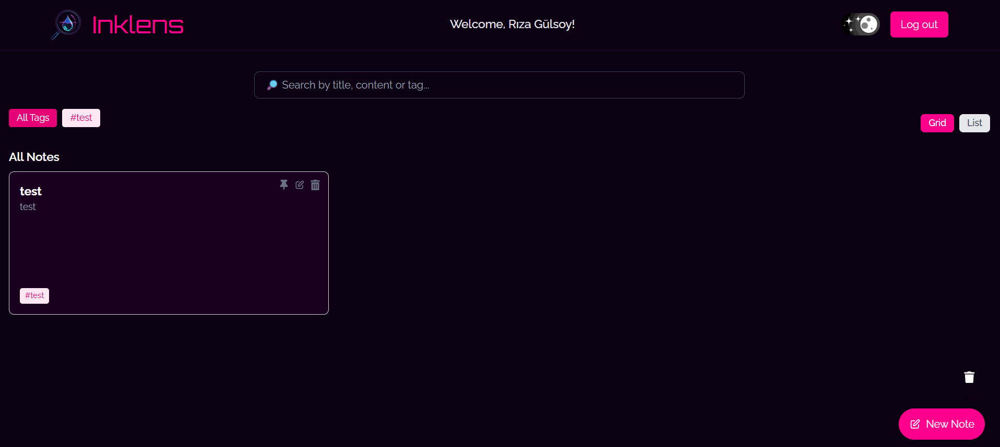
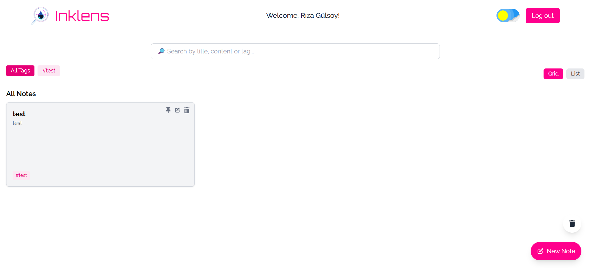

# Inklens Note App

A simple fullstack notes application built with **React**, **Express**, and **MongoDB**.  
This project allows users to create, edit, pin, delete notes and add images. Deleted notes go to a **Trash** and can be permanently deleted.

---

## 🌟 Features

- Create, edit, pin, and delete notes
- Soft delete (trash) and restore
- Search and filter by tags
- Responsive grid/list view
- User authentication via [Kinde](https://kinde.com)
  
---

## 🖼 Screenshots

**Home Page**

  
  

**Notes Page**

  
  

---

## 💻 Technology Stack
- **Frontend:** React, Tailwind CSS
- **Backend:** Express, Node.js
- **Database:** MongoDB Atlas, Mongoose ORM
- **Authentication:** Kinde Auth

---

## ⚙️ Setup

### 1. Clone the repository

```bash
git clone https://github.com/TheFierroS/Inklens_Note_App.git
cd Inklens_Note_App
```
### 2. Backend Setup
```bash
cd backend
npm install
```
**Create a .env file in the backend folder:**
```ini
MONGO_URI=YOUR_MONGO_URI
PORT=5000
CLOUDINARY_CLOUD_NAME=YOUR_CLOUDINARY_CLOUD_NAME
CLOUDINARY_API_KEY=YOUR_CLOUDINARY_API_KEY
CLOUDINARY_API_SECRET=YOUR_CLOUDINARY_API_SECRET
```
**Start the backend:**
```bash
node server.js
```
### 3. Frontend Setup
```bash
cd frontend
npm install
```
**Update Kinde information in `App.jsx` file in frontend folder:**
```ini
<KindeProvider                 //
      clientId=" "            //
      domain=" "             // Your Kinde İnformations
      redirectUri=" "       //
      logoutUri=" "        //
>
```
**Start the frontend:**
```bash
npm run dev
```
---

## 🛠 Usage

- Sign in with Kinde Auth.

- Create a new note with title, content, images, and optional tags.

- Pin important notes to keep them at the top.

- Delete notes to move them to the Trash.

- Restore notes from the Trash or permanently delete them.

---

## 📜 License

MIT License

---

## 🔐 Notes

Make sure to keep MongoDB URI and Kinde credentials secret.

`.env` files should not be committed to GitHub.
